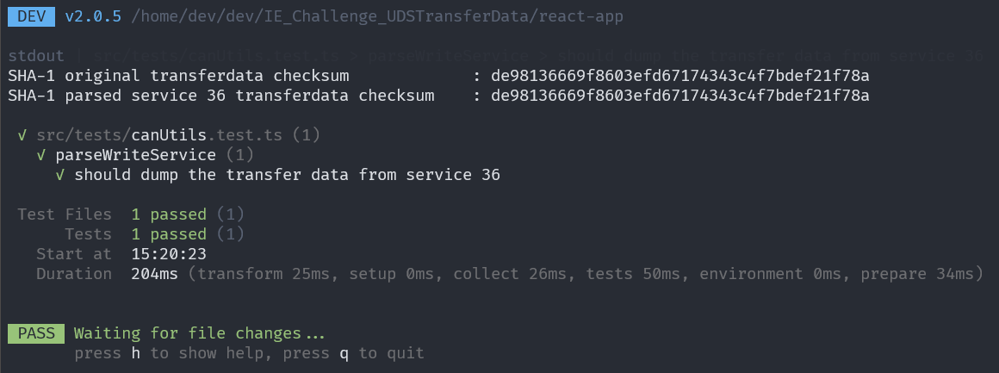
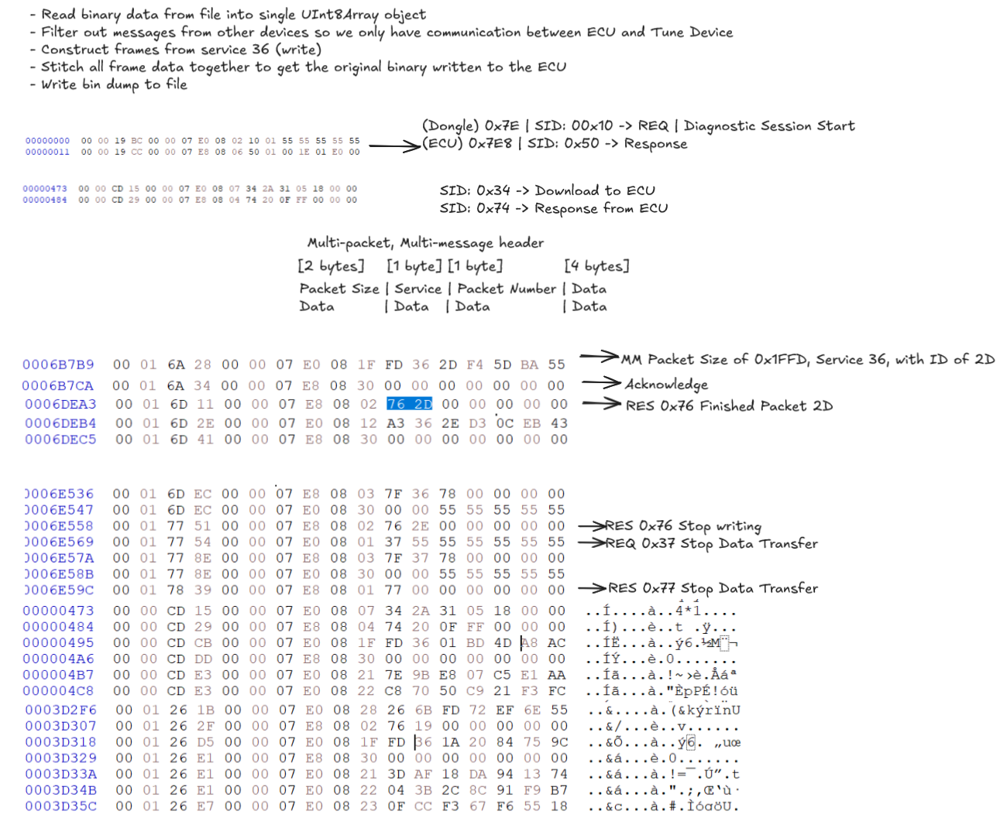

# IE_Challenge_UDSTransferData

Given the [provided](/src/tests/data/mg1cs002-stockmapsflash.candata) CAN bus data transfer log, identify and re-assemble the flash data sent to the ECU and verify it matches the original binary [mg1cs002-stockmapsflash.transferdata](/src/tests/data/mg1cs002-stockmapsflash.transferdata.bin)

# Setup

Run `yarn` inside project root to install pre-requisite packages.

# Run

You can start the dev server with `yarn dev`. From there you can open the app on `http://localhost:5173/`.

# Build

Run `yarn build`, the output will be in `/dist`. You can use python to run a server with this by using

```sh
python3 -m http.server 3000 -d dist
```

`http://0.0.0.0:3000/` will then be running the built app locally.

# Test

I wrote a test that verifies that the transferdata from the parsed and stitched frames match the original provided transferdata file. You can run the test with `yarn test`. I used SHA-1 checksums to verify data integrity.



[canUtils.test.ts](src/tests/canUtils.test.ts)

# Notes



# References

- Protocols: UDS, OBD2, WWH-OBD and OBDonUDS

  - https://www.csselectronics.com/pages/uds-protocol-tutorial-unified-diagnostic-services#uds-message-structure

- CAN Bus
  - https://en.wikipedia.org/wiki/CAN_bus
